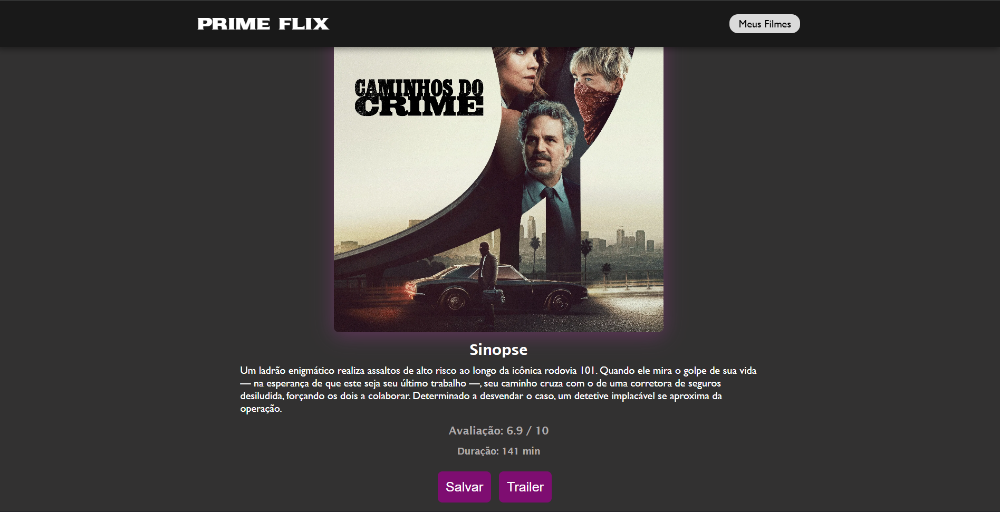

# Movie App (React)
## About the project
This is a movie web application built with React that consumes data from the TMDB API. Users can browse movies, view details and save their favorite titles.

 ## Features
- List of popular movies
- Movie details page
- Save favorite movies
- Prevent duplicate favorites
- Redirect to trailer search

## Technologies
- React
- JavaScript
- CSS
- TMDB API

## Live Demo
[https://lacerda-dev.github.io/movie-app-react/]

## Preview

