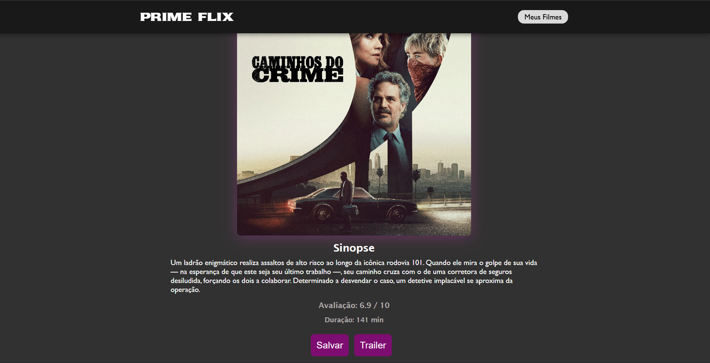
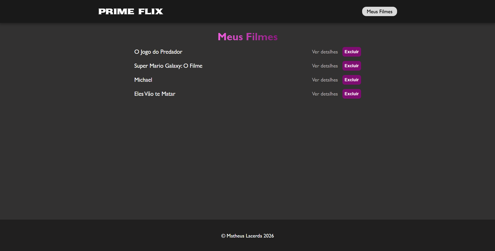
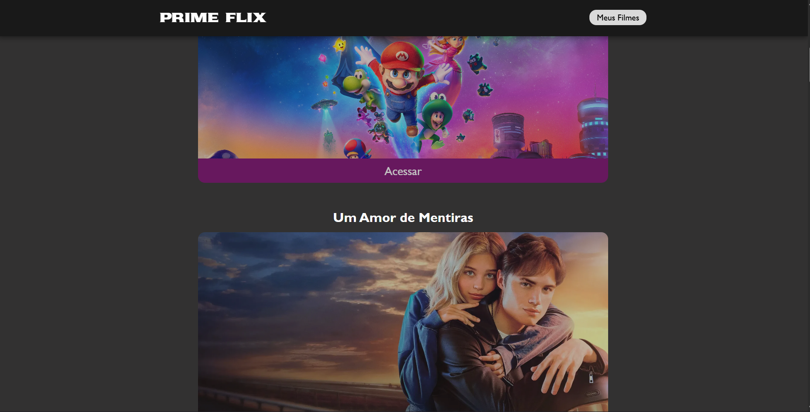

# Movie App (React)

## Overview

This project is a movie web application built with React that consumes data from the TMDB API. Users can browse popular movies, view detailed information and save their favorite titles for quick access.

## Screenshots

### Desktop

## Features

* Browse popular movies
* View movie details
* Save favorite movies
* Prevent duplicate favorites
* Redirect users to trailer search

## Technologies

* React
* JavaScript
* CSS
* TMDB API

## Live Demo

GitHub Pages

https://lacerda-dev.github.io/movie-app-react/

## Status

Completed

